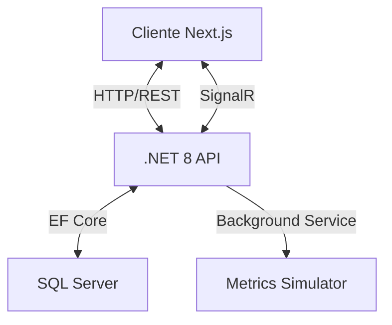

# Dashboard de Analítica Financiera 🚀
**Repositorio:** analytics-dashboard (Black Codex Chris)

Este proyecto es una herramienta de visualización de datos de alto rendimiento para el sector financiero, que permite el análisis de KPIs en tiempo real mediante una arquitectura moderna.


## 🛠️ Stack Tecnológico

- **Frontend:** Next.js 15 (App Router), TypeScript, Tailwind CSS, Framer Motion.
- **Backend:** C# con .NET 8 (Web API).
- **Base de Datos:** SQL Server con Entity Framework Core.
- **Tiempo Real:** SignalR (WebSockets).
- **Gráficas:** Recharts & Chart.js.
- **Estado:** React Query (TanStack Query).

## 🏗️ Arquitectura



## 🚀 Instrucciones de Configuración

### Backend (.NET)
1. Navega a la carpeta `/server`.
2. Asegúrate de tener instalado el SDK de .NET 9+.
3. Configura tu cadena de conexión en `appsettings.json` (por defecto usa LocalDB).
4. Ejecuta el servidor:
   ```bash
   dotnet run
   ```
   *La base de datos se creará automáticamente con 500 transacciones de prueba.*

### Frontend (Next.js)
1. Navega a la carpeta `/client`.
2. Instala las dependencias:
   ```bash
   npm install
   ```
3. Ejecuta el entorno de desarrollo:
   ```bash
   npm run dev
   ```
4. Abre [http://localhost:3000](http://localhost:3000) en tu navegador.

## 🔑 Credenciales de Prueba
- **Usuario:** `admin`
- **Contraseña:** *Cualquier contraseña superior a 6 caracteres (el simulador permite acceso rápido)*

## 📈 Funcionalidades Principales
- **Overview:** 6 KPIs con indicadores de tendencia y actualización en tiempo real cada 5 segundos.
- **Revenue:** Gráficas de área con histórico de 12 meses y filtros por fecha.
- **Expenses:** Desglose por categorías (Marketing, Nómina, etc.) y distribución porcentual.
- **Reports:** Exportación a CSV y balance waterfall de utilidad neta.

## 💡 Decisiones Técnicas
- **SignalR:** Elegido para garantizar que los financieros vean los cambios en el margen de utilidad sin refrescar la página.
- **React Query:** Implementado para manejar el estado del servidor, caché y sincronización eficiente.
- **Framer Motion:** Utilizado para dar una sensación de fluidez y modernidad ("Premium UI").

---
Desarrollado por **Black Codex Chris**
